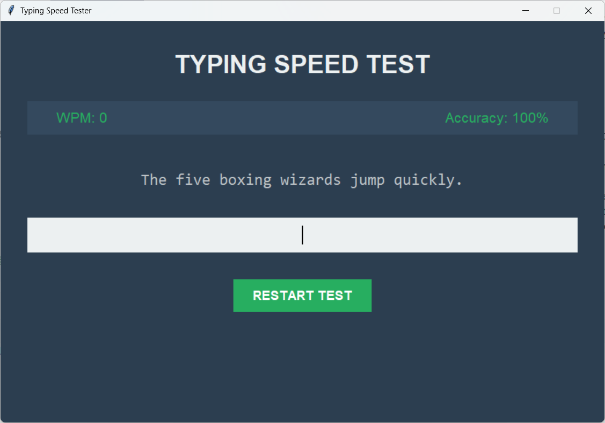

# Typing Speed Tester

A GUI-based Python application to measure your typing speed (Words Per Minute) and accuracy against a set of predefined sample texts. Built entirely using Python's standard `tkinter` library.

## Features
* **Real-time WPM Tracking:** Calculates your Words Per Minute continuously as you type.
* **Accuracy Measurement:** Instantly displays your typing accuracy percentage based on correct keystrokes.
* **Visual Error Feedback:** The text input dynamically turns red if you make a mistake, prompting immediate correction.
* **Modern UI:** A clean, dark-themed user interface designed for distraction-free typing.

## Screenshots
 

## Prerequisites
* Python 3.x installed on your system.
* `tkinter` (This comes pre-installed with standard Python distributions on Windows and macOS. Linux users might need to install it via their package manager, e.g., `sudo apt-get install python3-tk`).

## Installation and Usage

1. Clone this repository to your local machine:
   ```bash
   git clone [https://github.com/Muthu-Mkode/typing-speed-tester.git](https://github.com/Muthu-Mkode/typing-speed-tester.git)

```

2. Navigate into the project directory:
```bash
cd typing-speed-tester

```


3. Run the application:
```bash
python main.py

```


## License

This project is licensed under the MIT License - see the [LICENSE](LICENSE) file for details.
